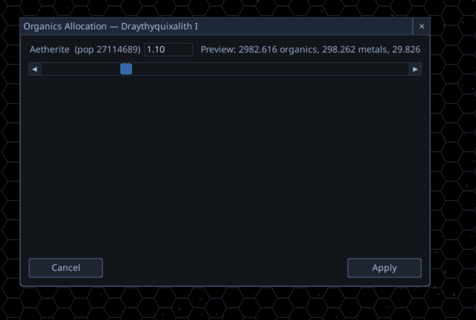

# Strategy Modal Window — Base Class Refactor (Eradicate Click-Through Bug Class)

## Context

A recurring bug class on the strategy screen: a modal window opens over
the galaxy/system map, but clicks inside the window also affect the
underlying map (selecting different hexes/planets, panning, etc.). The
modal is supposed to block input to the parent screen but does not.

**Past instances:**
- BUG-22 — `planet_list_window` originally absent from the modal-tracking
  scan.
- BUG-69 — `fleet_orders_window` / `fleet_report_window` / `transfer_dialog`
  close handlers wired up incorrectly.
- BUG-121 — `planet_abilities_window` slot leaked stale references after
  close, causing scroll-wheel zoom to break for the rest of the session.

**Newest instance** (QA Session 20260428_052952, 05:40):
The Organics Allocation window (`FoodAllocationEditor`) lets clicks pass
through to the strategy map underneath:

[](./assets/strategy_modal_food_allocation_repro.png)

This window isn't tracked as a modal at all — every interaction also
hits the map.

## Why this keeps happening — the contract is unenforceable

The current modal-tracking design imposes a **six-step manual contract**
that every new strategy modal window must follow:

1. Add `<window_name>: Optional[UIWindow] = None` slot field to
   [game/ui/screens/strategy_window_manager.py](../../game/ui/screens/strategy_window_manager.py).
2. Add the slot to `StrategyEventRouter.has_modal_open()` checks
   ([strategy_event_router.py](../../game/ui/screens/strategy_event_router.py)).
3. Add the slot to `_is_blocking_ui_element_at()` checks (same file).
4. Override `kill()` on the window class to invoke a passed-in
   `on_close_callback` before `super().kill()`.
5. Wire `on_close_callback` at the spawn site (registrar).
6. Implement an `_on_closed` registrar method that resets the slot
   to `None`.

Forget any of those six and you get either click-through (1–3 missed)
or stale-flag leak (4–6 missed). There is no compile-time or runtime
guard. The "parametrised contract test" added in BUG-121
(`tests/unit/ui/screens/test_strategy_window_manager_public_api.py::TestModalSlotCleanupContract`)
is **incomplete**: it hardcodes a 2-slot allowlist and uses
source-string matching for the rest, so it produces false negatives.

Asymmetric checks compound the fragility:
`has_modal_open()` uses `is not None`, while
`_is_blocking_ui_element_at()` uses `window.alive() and rect.collidepoint(...)`.
This is exactly the asymmetry that masked BUG-121 — clicks kept working
(alive-check passed) but scroll did not (is-not-None check leaked).

## Audit Results — 16 modal-tracked windows

Audit performed during QA Session 20260428_052952 triage. **Risk
classification:**

| Class | File | Slot? | has_modal_open? | _is_blocking? | kill_override? | on_close_wired? | Risk |
|-------|------|-------|---|---|---|---|---|
| PlanetListWindow | planet_list_window.py | ✓ | ✓ | ✓ | ✓ | ✓ | LOW |
| StarListWindow | star_list_window.py | ✓ | ✓ | ✓ | ✓ | ✓ | LOW |
| FleetReportWindow | fleet_report_window.py | ✓ | ✓ | ✓ | ✓ | ✓ | LOW |
| EventLogWindow | event_log_window.py | ✓ | ✓ | ✓ | ✓ | ✓ | LOW |
| EmpirePanelWindow | empire_panel_window.py | ✓ | ✓ | ✓ | ✓ | ✓ | LOW |
| EmpireBuildQueueWindow | empire_build_queue_window.py | ✓ | ✓ | ✓ | ✓ | ✓ | LOW |
| BuildQueueListWindow | build_queue_list_window.py | ✓ | ✓ | ✓ | ✓ | ✓ | LOW |
| PlanetAbilitiesWindow | planet_abilities_window.py | ✓ | ✓ | ✓ | ✓ | ✓ | LOW |
| SettingsWindow | settings_window.py | ✓ | ✗ (intentional) | ✗ (intentional) | ✓ | ✓ | LOW |
| OrdersWindow | orders_window.py | ✓ | ✓ | ✓ | ✗ | ✗ | **HIGH** |
| TransferDialog | transfer_dialog.py | ✓ | ✓ | ✓ | ✗ | ✗ | **HIGH** |
| CargoQuickDialog | cargo_quick_dialog.py | ✓ | ✓ | ✓ | ✗ | ✗ | **HIGH** |
| PlanetSelectionWindow | planet_selection_window.py | ✓ | ✓ | ✓ | ✗ (no callback fired) | ✗ | **HIGH** |
| SystemSelectionWindow | system_selection_window.py | ✓ | ✓ | ✓ | ✗ | ✗ | **HIGH** |
| FleetSelectionWindow | fleet_selection_window.py | ✓ | ✓ | ✓ | ✗ | ✗ | **HIGH** |
| (move_choice_window) | inline pygame_gui.UIWindow | ✓ | ✓ | ✓ | N/A | ✗ | MEDIUM |
| **FoodAllocationEditor** | food_allocation_editor.py | **✗** | **✗** | **✗** | ✗ | ✗ | **CRITICAL — already user-reported** |

### Summary
- **1 critical** (FoodAllocationEditor — user-reported in this QA session, no modal tracking at all)
- **6 high-risk** latent BUG-121-class regressions waiting to fire
- **1 medium** (inline window with hardcoded callback cleanup)
- **9 low** (full contract followed)

Without intervention the maintenance burden grows linearly with each new
window. Six of the seventeen tracked windows are already not contract-
compliant — that's a 35% defect rate.

## Code Investigation Findings

### Current loader state machine

`StrategyWindowManager.__init__` initialises ~16 `Optional[UIWindow]`
slots to `None`. `StrategyEventRouter.has_modal_open()` is a 16-clause
chain of `if self.window_manager.<slot> is not None: return True`.
`_is_blocking_ui_element_at()` is a similar chain that, fortunately,
uses `.alive() and rect.collidepoint(point)` instead of `is not None`
— this asymmetry is the latent bug source.

### How spawn currently works

The "registrar" pattern (`PlanetListRegistrar`, `PlanetAbilitiesRegistrar`,
etc.) is convention, not contract:
1. Registrar instantiates the window with
   `on_close_callback=self._on_closed`.
2. Registrar's `_on_closed()` resets `composer.<slot> = None`.
3. Window's overridden `kill()` invokes the callback before
   `super().kill()`.

Five windows skip step 3 (HIGH risk). One window (FoodAllocationEditor)
has no registrar at all (CRITICAL).

### How the BUG-121 fix paved the way

BUG-121 introduced the `kill()`-fires-callback pattern explicitly for
`PlanetAbilitiesWindow` and added the parametrised contract test.
That work is the right pattern but applied as a one-off; the goal of
this project is to **make that pattern the default** so individual
windows can't opt out by accident.

## Proposed Architecture — Option A: `StrategyModalWindow` Base Class

Replace the 16-slot field array on `StrategyWindowManager` with a single
list of live modal windows, and replace the manual contract with a base
class that handles registration and cleanup automatically.

### Sketch

```python
# game/ui/screens/strategy_modal_window.py  (NEW)
class StrategyModalWindow(UIWindow):
    """Base class for any UIWindow that should block strategy-screen input.

    Subclasses get auto-registration on construction and auto-deregistration
    on kill() — no manual slot wiring required.
    """
    def __init__(self, *, window_manager: "StrategyWindowManager", **kwargs) -> None:
        super().__init__(**kwargs)
        self._window_manager = window_manager
        window_manager.register_modal(self)

    def kill(self) -> None:
        # Always deregister, even if super().kill() raises.
        try:
            self._window_manager.unregister_modal(self)
        finally:
            super().kill()
```

```python
# StrategyWindowManager — drop 16 slot fields, gain ONE list
class StrategyWindowManager:
    def __init__(self, ...) -> None:
        self._modals: list[UIWindow] = []
        # ... non-modal slots stay (e.g. settings_window) ...

    def register_modal(self, window: UIWindow) -> None:
        self._modals.append(window)

    def unregister_modal(self, window: UIWindow) -> None:
        try:
            self._modals.remove(window)
        except ValueError:
            pass  # Already deregistered or never registered.

    def iter_live_modals(self) -> Iterator[UIWindow]:
        # Self-cleaning iterator — drops dead references on traversal.
        self._modals = [w for w in self._modals if w.alive()]
        yield from self._modals
```

```python
# StrategyEventRouter — collapses 16-clause chain into 1 line
def has_modal_open(self) -> bool:
    return any(True for _ in self.window_manager.iter_live_modals())

def _is_blocking_ui_element_at(self, point: tuple[int, int]) -> bool:
    return any(w.rect.collidepoint(point)
               for w in self.window_manager.iter_live_modals())
```

### Why this is structurally correct

- **Registration cannot be forgotten.** It happens in the base class
  constructor before any subclass code runs.
- **Cleanup cannot be forgotten.** `kill()` is overridden in the base.
  Even pygame_gui's `[X]` close path goes through `kill()`.
- **Asymmetry is gone.** Both `has_modal_open` and `_is_blocking` walk
  the same `.alive()`-filtered list. No more `is not None`-vs-`.alive()`
  divergence.
- **Slot fields disappear.** No more 16 manual `Optional[UIWindow]`
  fields on `StrategyWindowManager`. Per Rule 3 (Clean-Sheet), the slot
  pattern is eradicated rather than maintained alongside.
- **Test contract becomes simple.** A single test asserts that any
  `StrategyModalWindow` subclass auto-registers on creation and
  auto-deregisters on kill. The 16-row parametrised allowlist test
  goes away.

### Why not Options B or C

- **Option B (helper functions):** keeps the slot pattern, just sugars
  it. Doesn't eliminate the per-window discipline requirement.
- **Option C (pygame_gui native modal flag):** unproven that
  pygame_gui's blocking integrates with the strategy event router's
  pan/zoom/click-handling. Worth a spike during the project but the
  base-class approach works regardless.

## Scope Notes

This warrants a project rather than a feature track because:

1. **17 windows touched** for the migration, plus the registrars and the
   event router. Single-feature scope is too small.
2. **Test infrastructure changes** — the parametrised contract test is
   replaced; new base-class invariant tests added.
3. **Architectural refactor** of `StrategyWindowManager`'s shape — slot
   fields removed entirely. That's a Rule-3 eradication, which is the
   project track.
4. **Incremental migration risk** — windows not yet migrated must still
   work via the legacy slot system during the migration. Phase
   sequencing matters.

## Proposed Project Phases (starting points for interactive setup)

These are suggestions only. The plan finalises during interactive
project setup.

- **Phase 1 — Base class + tests.**
  Add `StrategyModalWindow` base class. Add invariant tests:
  - On `__init__`, instance appears in `iter_live_modals()`.
  - After `kill()`, instance no longer appears.
  - After raw `pygame_gui` `[X]`-close (which routes through `kill()`),
    instance no longer appears.
  - `has_modal_open()` and `_is_blocking_ui_element_at()` agree on
    every instance.
- **Phase 2 — Migrate the 6 broken windows first.**
  `FoodAllocationEditor` (critical), `OrdersWindow`, `TransferDialog`,
  `CargoQuickDialog`, `PlanetSelectionWindow`, `SystemSelectionWindow`,
  `FleetSelectionWindow`. Each commit removes the corresponding slot
  field from `StrategyWindowManager` and the corresponding clause from
  `has_modal_open` / `_is_blocking`.
- **Phase 3 — Migrate the 9 working windows.**
  Lower urgency, but keep going to delete the slot pattern entirely.
  Each window subclasses `StrategyModalWindow`, drops its custom
  `kill()` callback wiring, drops its registrar's `_on_closed` method.
  No backward-compat shims — Rule 3.
- **Phase 4 — Migrate the inline `move_choice_window`.**
  Promote from inline `pygame_gui.UIWindow` construction to a small
  named subclass of `StrategyModalWindow`. Drop the hardcoded callback
  cleanup.
- **Phase 5 — Delete the legacy contract.**
  Remove the 16-clause chains from `has_modal_open` and
  `_is_blocking_ui_element_at`. Delete the parametrised
  `TestModalSlotCleanupContract` test. Delete the `Optional[UIWindow]`
  slot fields from `StrategyWindowManager` for migrated windows
  (only `settings_window` remains as a non-modal direct slot).
- **Phase 6 — Documentation.**
  Update `docs/01_ARCHITECTURE.md`, `docs/03_CONVENTIONS.md` (UI
  conventions), and `docs/06_UI_STYLE_GUIDE.md` (if exists) to
  document the base class as the canonical way to add a strategy
  modal. Delete the old "register a slot" guidance everywhere.

## Acceptance Criteria

- Every strategy-screen-modal window subclasses `StrategyModalWindow`.
- `StrategyWindowManager` has no `Optional[UIWindow]` modal slot fields
  — only `settings_window` and any other genuinely non-modal slots.
- `has_modal_open()` and `_is_blocking_ui_element_at()` are each one
  line walking `iter_live_modals()`.
- Closing a strategy modal window via `[X]`, programmatic `kill()`,
  Cancel/Apply/Close button paths, or external `_handle_window_close`
  all yield the same outcome: the window is no longer in
  `iter_live_modals()` and `has_modal_open()` returns False.
- The food-allocation-window QA repro (clicks pass through to map)
  no longer happens — covered by integration test.
- Full test suite passes with 0 regressions.

## Origin

QA Session [20260428_052952](../../Tools/qa_observer/session_data/20260428_052952/QA_Session_Log.md)
at 05:40. User-directed scope expansion to system-level rethink on
2026-04-28 after triage audit revealed 6 latent windows with the same
class of bug.

## Related Bugs (history of point fixes for this same class)

- **BUG-22** — planet_list_window absent from modal scan (point fix).
- **BUG-69** — fleet_orders_window / fleet_report_window / transfer_dialog
  close handlers wired up incorrectly (point fix).
- **BUG-121** — planet_abilities_window stale-flag leak; introduced the
  `kill()`-fires-callback pattern + parametrised contract test.

This project supersedes the per-window approach taken by all three.
