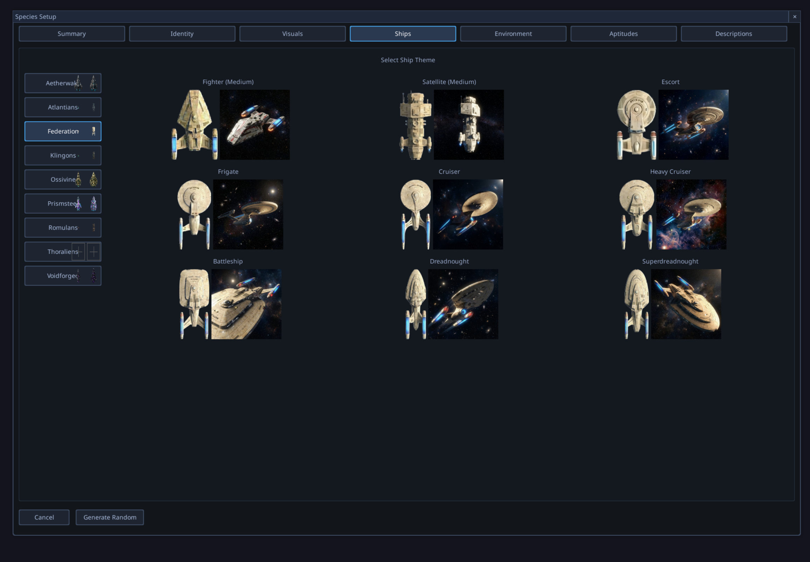
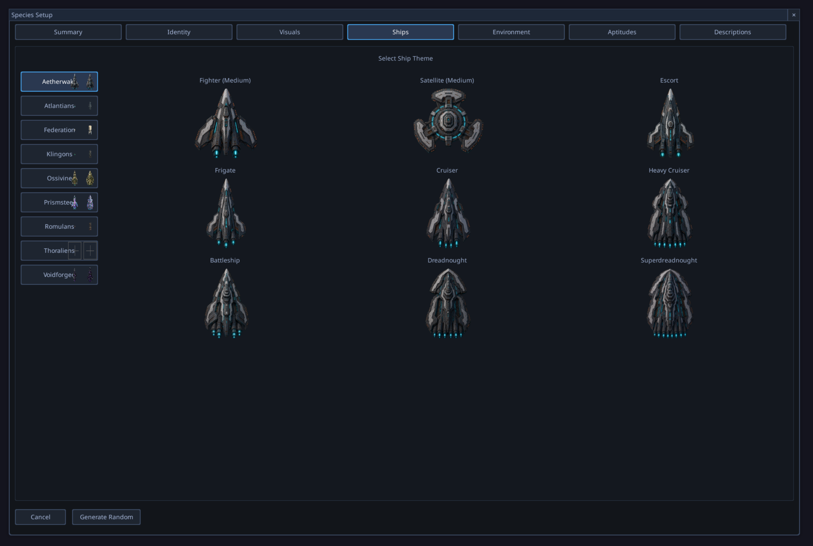
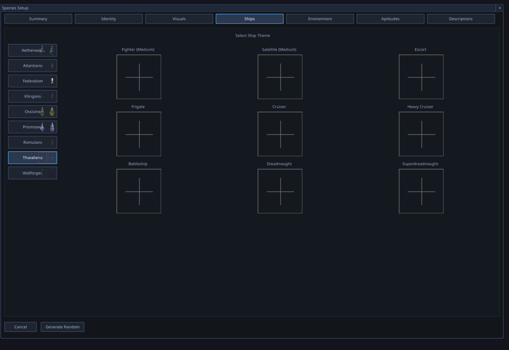

# Ship Themes — Unified Schema Migration with AI-Backfilled Portraits

## Context

The Race Setup → Ships tab currently renders three different visual states
across the nine installed ship themes, because the project has drifted
between two `theme.json` schemas and inconsistent portrait coverage:

1. **Federation (working baseline)** — every ship slot shows two images
   side by side: a skin (top-down sprite) and a portrait (artistic
   side-view).
2. **Aetherwake** — every slot shows skin only; no portrait artwork
   exists for this theme on disk.
3. **Thoraliens (Aliens)** — every slot is empty (placeholder + crosshair).
   Both skins and portraits exist on disk, but the loader cannot read
   them because Thoraliens uses a different `theme.json` schema.

This was uncovered in QA Session 20260428_052952 at 05:36–05:37.

## Screenshots

[](./assets/ship_themes_federation_working.png)
*Federation theme — the working baseline. Each slot shows a skin (left) and
a portrait (right).*

[](./assets/ship_themes_aetherwake_no_portraits.png)
*Aetherwake theme — only skins render. No `Portraits/` directory exists
on disk for this theme.*

[](./assets/ship_themes_thoraliens_empty.png)
*Thoraliens theme — every slot is empty. Skins and portraits exist on
disk; the loader can't read the theme.json schema this theme uses.*

## Code Investigation Findings

### Two competing schemas in `theme.json`

**Old schema** (Federation, Aetherwake, and others — to be confirmed
during project Phase 1):
```json
{
    "name": "Federation",
    "images": {
        "Battleship": "Skins/battleship.png",
        ...
    }
}
```
Flat map of ship class → skin path. **No portrait declaration** — portraits
are loaded by an unrelated hardcoded path convention (see below).

**New schema** (Thoraliens):
```json
{
    "name": "Thoraliens",
    "assets": {
        "Battleship": {
            "skin": "Skins/battleship.png",
            "portrait": "Portraits/battleship.png"
        },
        ...
    }
}
```
Per-ship object with explicit `skin` + `portrait` paths.

### The loader only handles the old schema

[game/ui/assets/ship_theme_manager.py:93](../../game/ui/assets/ship_theme_manager.py#L93):
```python
image_map = data.get('images', {})
```

For Thoraliens (no `images` key), this falls back to `{}`, so no skins
register and the entire theme renders empty.

### Portrait loading uses a hardcoded path + filename convention

[game/ui/assets/ship_theme_manager.py:269-289](../../game/ui/assets/ship_theme_manager.py#L269-L289):
```python
# "Battleship" -> "Battleship_Portrait.jpg"
portrait_filename = f"{portrait_name}_Portrait.jpg"
portrait_path = os.path.join(theme_dir, "Portraits", portrait_filename)
```

This convention only matches Federation's actual files
(`Battleship_Portrait.jpg`, capitalised, JPG). Thoraliens' lowercase
PNG portraits would not be found by this convention even if the loader
read its skins. Aetherwake has no `Portraits/` directory at all, so
the convention silently returns `None`.

### Ship-class name normalisation

The portrait-name converter [`_ship_class_to_portrait_name`](../../game/ui/assets/ship_theme_manager.py#L262)
maps display names to portrait file basenames (e.g. `"Fighter (Medium)"`
→ `"MediumFighter"`). The Thoraliens `assets` schema uses a different
naming convention (`"MediumFighter"` as the key directly), so any
unified scheme has to settle on one canonical name set.

## Scope Notes

This is project-sized, not a bug-pair, because:

1. **Schema migration touches every theme.** Nine themes × ~19 ship
   slots × {skin, portrait} = ~342 file references to verify or rewrite.
2. **The portrait-loading convention is hardcoded** in two places at
   least (filename pattern + path layout). Making it data-driven from
   `theme.json` is a non-trivial loader refactor and needs new tests
   pinning the contract.
3. **Asset generation is required** for at least Aetherwake (no
   portraits on disk). Likely other themes have gaps too — Phase 1
   audit will enumerate. The user wants the project to use OpenAI's
   image-2 model to regenerate missing portraits.
4. **Image size validation** has to be added — no current code
   verifies that portraits are within expected dimensions before they
   land in the cache.
5. **Backwards compatibility is not desired** — per CLAUDE.md Rule 3
   (Clean-Sheet Design) and the System Migration Policy, the old
   `images` schema should be eradicated, not kept as a parallel code
   path.

## Proposed Project Structure (for interactive setup)

These are starting-point suggestions only — the project plan will
finalise during interactive setup:

- **Phase 1 — Audit.** Enumerate all nine themes; for each, record
  schema version (`images` vs `assets`), skin file inventory, portrait
  file inventory, naming-case inconsistencies, and missing assets.
  Output: a single reference table.
- **Phase 2 — Loader unification.** Migrate `ShipThemeManager` to read
  the `assets` schema canonically. Delete the hardcoded
  `<Class>_Portrait.jpg` convention. Add image-size validation at
  load time (with a configurable expected size or per-theme
  declaration).
- **Phase 3 — Schema migration.** Convert each old-schema theme.json
  to the new `assets` form. No backward-compat shim.
- **Phase 4 — Asset backfill (AI generation).** For every theme with
  missing portraits, generate them via OpenAI's `gpt-image-2` (or
  current equivalent) using the existing `game/services/llm/`
  infrastructure as a reference for client setup. Save into the
  theme's `Portraits/` directory using the new naming convention.
- **Phase 5 — Naming-case normalisation.** Pick one canonical case for
  ship-class keys across all themes (CamelCase per Thoraliens, or
  display-form per Federation — TBD). Migrate all themes to it.
- **Phase 6 — Tests + docs.** New tests pinning the loader contract
  (every theme must declare every ship class, every declared file
  must exist, every image must match expected size). Update
  `docs/01_ARCHITECTURE.md` and any guide that describes the theme
  format.

## Related QA observations

- BUG-122 (Thoraliens empty) and BUG-123 (Aetherwake no portraits)
  were initially scoped as separate bugs during triage but rolled up
  into this project per user direction — both are symptoms of the
  same underlying schema-drift problem and the unified migration
  resolves both at once.

## Origin

QA Session [20260428_052952](../../Tools/qa_observer/session_data/20260428_052952/QA_Session_Log.md)
at 05:36–05:37. User-directed conversion to project on 2026-04-28.
