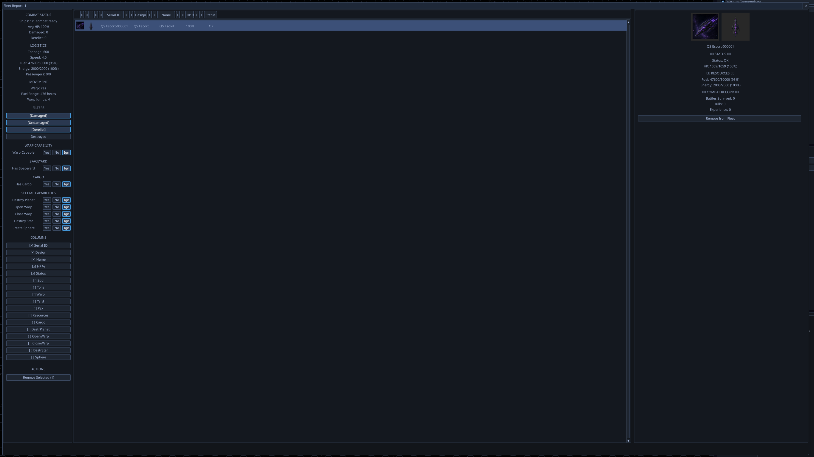
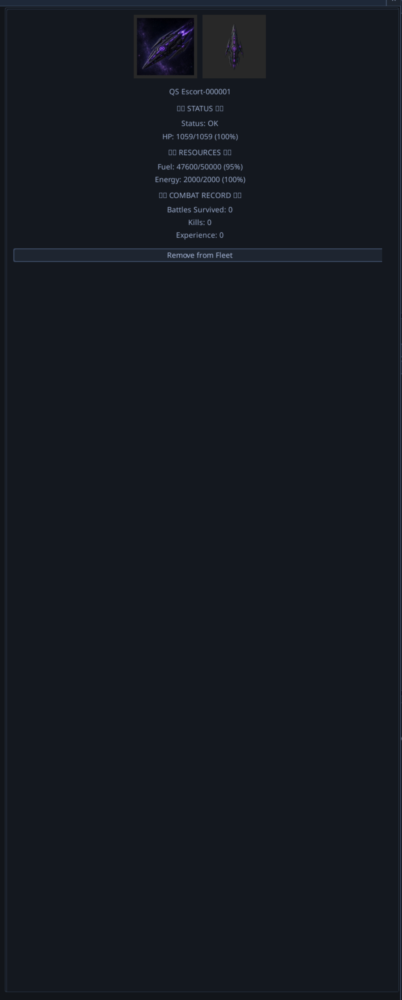

# Fleet Report — Per-Component Damage View

## Context

When a ship is selected in the Fleet Report, the right-hand ship-detail
panel currently shows summary information only: ship name, Status (HP),
Resources (Fuel/Energy), Combat Record (Battles/Kills/XP), and a
"Remove from Fleet" button. There is no way to see which individual
components on the ship are damaged or destroyed.

The user wants the panel to show **every component on the ship**,
visually styled like the Workshop component palette, with damage
percentage and a functionality indicator per component (or per
identical-component group when collapsed).

This was raised in QA Session 20260428_052952 at 05:49–05:51.

## Screenshots

*Fleet Report — left list of ships, right side ship-detail panel after
selecting one ship.*

*The current right-hand panel — Status / Resources / Combat Record /
Remove button. No component-level information at all.*

## Required Behaviour

### List + grouping
- Show every component on the selected ship, **grouped by layer**
  (Core / Inner / Outer / Armor / Hull) — same grouping as the
  Workshop component palette so the visual idiom is reused.
- Identical components (same `component_id`) **collapse** into a
  single expandable row showing `<name> × <count>` with a chevron.
  Expanding the chevron reveals one row per instance, each with its
  own damage % and functionality indicator.

### Damage display rules
- **Per-instance row (expanded view):** show damage as a percentage
  derived from `ComponentState.current_hp / max_hp`. 100% renders
  neutral; below 100% renders with a warning tint; 0% (destroyed)
  renders crossed-out / error tint.
- **Group row (collapsed view):** show the **average** damage % across
  the group, NOT the worst.
  *Example:* 4 engines, two at 75% HP and two at 25% HP → group reads
  **50%** (mean).
- **Functionality indicator (group row):** every component has a
  `damage_threshold` (default 0.5 — confirmed at
  [game/simulation/components/component.py:133](../../game/simulation/components/component.py#L133)).
  Below `current_hp < max_hp * damage_threshold` the component is
  inactive (`is_active = False`,
  [component_health_manager.py:73-75](../../game/simulation/components/component_health_manager.py#L73-L75)).
  Group rows show a fraction `<functional_count> / <total>` next to
  the name.
  *Example:* 4 engines, 2 below threshold → group reads `2 / 4`
  alongside the 50% average damage.

### Read-only contract
- No add / remove / move / quick-action buttons.
- The panel is informational only — visual match for the Workshop
  palette, functional inertness.

## Code Investigation Findings

### The data already exists end-to-end

A pre-investigation agent confirmed that per-component damage is
fully tracked, persisted, and round-trips through battles:

- **Per-component HP and active flag:** `Component.current_hp` /
  `Component.is_active` /
  [`Component.damage_threshold`](../../game/simulation/components/component.py#L133).
  Mutated by [`ComponentHealthManager.take_damage()`](../../game/simulation/components/component_health_manager.py#L41).
- **End-of-battle persistence:** [`ShipInstanceBridge.update_from_ship()`](../../game/strategy/data/ship_instance_bridge.py#L115-L163)
  rebuilds `ShipInstance.components` from the post-battle simulation
  Ship; [`apply_outcome_to_fleets()`](../../game/strategy/combat/post_battle_hook.py#L40)
  invokes the bridge after every battle.
- **Save-load round-trip:** `ShipInstance.components` is a dict of
  `ComponentState(component_id, instance_index, current_hp, max_hp, is_active)`
  serialised in
  [`ShipInstanceSerializer.to_dict()` / `from_dict()`](../../game/strategy/data/ship_instance_serializer.py#L24).
- **No phantom auto-repair:** `ShipInstance.repair()` is manual-only;
  no turn-end hook calls it.
- **Existing helper:**
  [`ShipInstance.get_damaged_components_by_layer()`](../../game/strategy/data/ship_instance.py#L551-L588)
  already returns layer-grouped damage info — the project can reuse
  or extend this rather than walking `components` raw.

### Reusable widget reference

The Workshop's component-palette item lives at
[game/ui/screens/builder/components.py:14](../../game/ui/screens/builder/components.py#L14)
(`ComponentListItem`). It is **mutable** — has add/remove handlers
wired in. The project will need either a read-only sibling widget or
a parameter that disables the action affordances and changes the
hover/click hit-testing accordingly.

### `damage_threshold` lives on the simulation `Component`, not on `ComponentState`

`ComponentState` (the strategy-layer record) has `current_hp`,
`max_hp`, `is_active`, but NOT `damage_threshold`. To compute the
functional / total fraction in a group, the UI either:
- looks up `damage_threshold` from the `ComponentRegistry` by
  `component_id` (registry available via `ApplicationContext`), or
- relies on `is_active` directly — which is the simpler and more
  correct path because `is_active` already encodes the threshold
  decision made during combat.

Recommendation: **use `is_active` directly**. Functional count =
`sum(cs.is_active for cs in instances_in_group)`. No threshold
arithmetic in the UI layer.

## Scope Notes — Project-sized

This is a project rather than a feature track because:

1. **New facade DTO required.** The fleet-report panel currently
   reads a few summary fields from a slice of the strategy facade.
   Surfacing per-component grouped damage is a new query shape that
   crosses the registry boundary (component display names live in the
   component registry, not on `ComponentState`). A new DTO + facade
   query method is non-trivial.
2. **New UI widget family.** The Workshop panel is heavily mutation-
   oriented; extracting a read-only sibling that shares visual style
   without inheriting behaviour is a real refactor, not a one-file
   change. Aggregation widgets (the group-row with chevron expand,
   average %, and functional fraction) are new.
3. **Tests across all three layers.** Strategy facade query, UI
   widget rendering for collapsed/expanded states, layer grouping
   correctness, average-vs-worst arithmetic, functional-fraction
   rendering, expand/collapse interaction.
4. **Aesthetic alignment.** "Look like the components panel from the
   ship designer" means the visual language must match — colours,
   row heights, chevron iconography, hover states. That's a
   designer-touch pass, not a quick UI bash.

## Proposed Phases (interactive setup will finalise)

- **Phase 1 — Data layer audit + DTO design.** Walk
  `ShipInstance.components` and confirm the registry lookup path for
  per-component display names. Design a `ShipComponentBreakdown` DTO
  with one entry per layer, each entry holding a list of
  `ComponentGroup(component_id, display_name, total, functional,
  avg_damage_pct, instances: list[InstanceState])`. Per-instance
  state is `InstanceState(damage_pct, is_active)`.
- **Phase 2 — Facade query.** Add the corresponding query method to
  the appropriate facade slice (likely `EmpireSlice` or a new
  `FleetSlice`), returning the new DTO.
- **Phase 3 — Read-only component widget.** Either extract a
  `ReadOnlyComponentListItem` from
  `game/ui/screens/builder/components.py` (preferred), or build a
  lookalike that shares CSS-level theming. Mutation handlers
  removed; hover/select still allowed for tooltips.
- **Phase 4 — Group row widget.** Collapsible group widget with
  chevron expand, name, count, **average** damage %, and
  `<functional> / <total>` fraction. Expanding swaps content for a
  list of `ReadOnlyComponentListItem` per-instance rows.
- **Phase 5 — Fleet Report integration.** Mount the new widget tree
  in the right-side ship-detail panel below the existing summary
  blocks. Persist expand/collapse state across ship-selection within
  the same Fleet Report session.
- **Phase 6 — Tests + docs.** Unit tests for the DTO computation
  (average %, functional count, layer grouping). UI tests for
  collapsed-vs-expanded rendering, damage-tier styling, read-only
  enforcement. Update `docs/04_SERVICES.md` for the new facade
  query and `docs/06_UI_STYLE_GUIDE.md` for the read-only-widget
  pattern.

## Out of Scope

- A "Repair component" action (separate feature; see
  `ShipInstance.repair()` if/when added to UI).
- Showing component-level abilities or ability tooltips (those live
  on the simulation `Component`, not `ComponentState` — would
  require additional registry lookups).
- Mass / cost / power consumption columns.
- Sorting by damage %, layer, or component type — the layer grouping
  is the only ordering for v1.

## Acceptance Criteria

- Selecting any ship in the Fleet Report shows the new per-component
  panel below the existing summary blocks.
- Components are layer-grouped (Core / Inner / Outer / Armor / Hull).
- Identical components collapse into a single row showing
  `<name> × <count>`, the **average** damage % across the group, and
  a `<functional> / <total>` fraction reflecting `is_active` count.
- Expanding a group shows one row per instance with its individual
  damage % and functional state.
- Damaged components render with a warning tint; non-functional
  (`is_active = False`) components render crossed-out / error tint.
- No buttons or other interactive actions appear inside the panel.
- All `ShipInstance.components` round-trip through save/load with
  zero regressions in damage display after reload.

## Origin

QA Session [20260428_052952](../../Tools/qa_observer/session_data/20260428_052952/QA_Session_Log.md)
at 05:49–05:51. User-directed scope to project on 2026-04-28, with
explicit refinements:
- Collapsed view shows **average** damage, not worst.
- Group row carries a **functional / total** fraction based on the
  `damage_threshold` / `is_active` rule.
