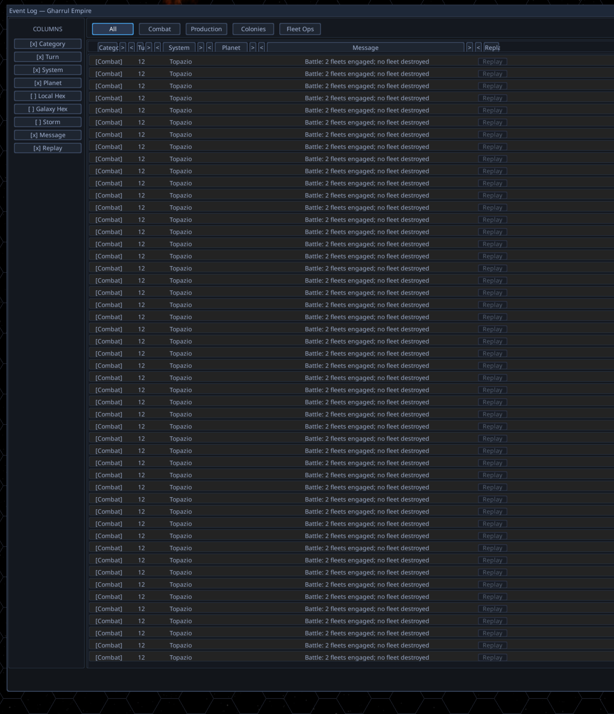

# Strategic Combat Round Budget

## Context

When two opposing fleets occupy the same sector during a strategic turn, the
conflict resolver currently fires once **per tick** (TICKS_PER_TURN = 100), so
a contested sector can produce up to ~100 sequential battles in a single turn.
This is observable in the event log, which scrolls through page after page of
combat results from the same encounter (see screenshot).

The desired model: each contested encounter resolves a number of combat rounds
equal to the **sum of the engaged fleets' remaining strategic movement** at
the moment of engagement. Example: Fleet A enters a sector with 6 strategic
moves remaining and Fleet B has 4 → 10 rounds of combat over the turn,
assuming neither side dies, retreats, or successfully disengages. Each round
represents a "tick where one fleet could have moved but didn't."

## Spoken commentary (cleaned, 18:54:04 – 18:55:24)

> I believe there's a problem with combat processing. The way I want combat to
> be processed is: each time a fleet is in a sector with another opposing
> enemy fleet, if Fleet A has 6 strategic movements left and Fleet B has 4
> strategic movements left, and they just don't move anywhere, there should
> be a grand total of 10 rounds of combat. Each time Fleet A could have moved
> but didn't, there should be a round of combat. Each time Fleet B could have
> moved but didn't, there should also be a round of combat. (Assuming nothing
> dies and nobody retreats.) I'm pretty sure you're running a round of combat
> every single tick — so two vessels on top of each other run for 100 ticks.

## Screenshot

The Strategy event log shows screen after screen of combat events from a
single contested encounter — each tick produced its own battle resolution.

## Code Investigation Findings

| Area | File:line | Current behavior |
|---|---|---|
| Tick loop | `game/strategy/engine/turn_engine.py:524` (`for tick in range(1, TICKS_PER_TURN + 1)`) | Drives 100 ticks per turn |
| Conflict invocation | `game/strategy/engine/turn_engine.py:698` (`self.conflict_engine.resolve_all_conflicts(...)`) | Called unconditionally every tick |
| Conflict detection | `game/strategy/engine/conflict_resolution_engine.py:247-268` (`_resolve_conflicts`) | Rebuilds hex_map from scratch each tick; any tick where opposing fleets share a hex triggers `_resolve_combat_at_hex` |
| Battle invocation | `game/strategy/engine/conflict_resolution_engine.py:269-374` (`_resolve_combat_at_hex`) | Calls `_battle_resolver.resolve_battle(...)` once per invocation |
| Re-engagement comment | `game/strategy/engine/conflict_resolution_engine.py:19-20` | Module docstring explicitly states "If two co-located fleets both retain ships, combat re-engages on the next strategy tick" — current design is intentional but per-tick |
| Movement model | `game/strategy/services/fleet_speed_calculator.py:39-58` (`get_tick_interval`) | Pure interval-based: `interval = max(1, 100 // speed)`. **No remaining-movement counter exists on Fleet today.** |

User's hypothesis ("running a round of combat every single tick") is confirmed
by the code.

## Scope Notes — Why This Is Project-Sized

This is not a one-line throttle. Implementing the round-budget model requires
new state, new scheduling, and several genuine design decisions:

1. **Introduce remaining-movement state per fleet.** Currently movement is
   purely interval-based (a fleet at speed-5 moves every 20 ticks; nothing
   tracks "moves remaining"). The new model implies a per-fleet counter that
   decrements each tick the fleet had a movement opportunity, regardless of
   whether the fleet actually moved.

2. **Encounter-scoped combat scheduling.** Today contested-sector detection
   runs every tick. The new model needs to either (a) detect *encounters*
   (fleets enter the same hex, lock in a round budget, then schedule N
   combat rounds across the remaining ticks of the turn) or (b) keep per-tick
   scanning but consult a "rounds remaining for this encounter" counter.

3. **Mid-turn entry/exit semantics.** What happens if Fleet C enters a hex
   that already has Fleet A vs Fleet B contested? Does C's remaining movement
   add to the round budget? What if a fleet successfully disengages /
   retreats — are unspent rounds returned? What if a fleet *does* move and
   leaves the sector mid-encounter?

4. **Round distribution across the turn.** Spread rounds evenly across
   remaining ticks, front-load them, or fire them on the same ticks the
   engaged fleets would otherwise have moved? Different choices give different
   "feel" to the strategic layer.

5. **Save / replay impact.** Any change to round counts will change battle
   results and replay history; existing in-progress saves will diverge.
   Aligns with the project's "old saves are disposable" rule but worth flagging.

6. **Battle log volume.** This change is also the natural place to address the
   event-log spam (Obs 2c/2d): far fewer combat events per turn means the
   replay UI's blocked state is more obviously a bug rather than a defense
   against spam.

7. **Interaction with PROJ-275 (N-team combat).** Round budget needs to
   handle 3+ teams co-located: is the budget sum-of-all, max, or pairwise?

8. **Per-round tick budget by engagement composition.** Currently each combat
   round runs the full simulator-default tick count (or hits the
   `simulation_adapter.py:127-130` "no capable ships" shortcut → 0 ticks
   when nobody has weapons). The user has asked for tick budget to **scale
   down** in degenerate or one-sided engagements:
   *"anytime there are no weapons present on any ship, we're going to
   reduce the tick count for each round of combat."*
   Concrete cases to define:
   - All ships unarmed on every side: shortcut already fires; verify a
     replay is still captured (see issue #8).
   - Only one side armed, other side present but unarmed: today this likely
     hits the same shortcut; do we want a brief sim run instead so the
     armed side can actually destroy something / chase / kite?
   - Both sides armed but one is a tiny picket vs a battlefleet: should the
     tick budget shrink based on expected resolution time, or stay full?
   - Should the tick-per-round budget be a tunable in `data/` rather than a
     hard-coded constant?
   This sub-item was originally raised as a separate observation but is the
   same physical change as the round-budget redesign.

## Open Questions for the User

- For the round-budget formula in 3+-team encounters: sum of all engaged
  fleets' remaining moves, or some other combinator?
- Should "remaining strategic movement" be a property derived from
  `(turns_elapsed × speed)` math, or genuinely stored as decrement-each-tick
  state on the Fleet?
- Should rounds be queued and fired across remaining ticks (preserving
  visual pacing) or front-loaded into the encounter tick?

## Suggested Next Step

`/claude-triage-to-proj strategic_combat_round_budget` to convert this triage
into a phased PROJ-XXX with design decisions, phase plan, and TDD targets.
