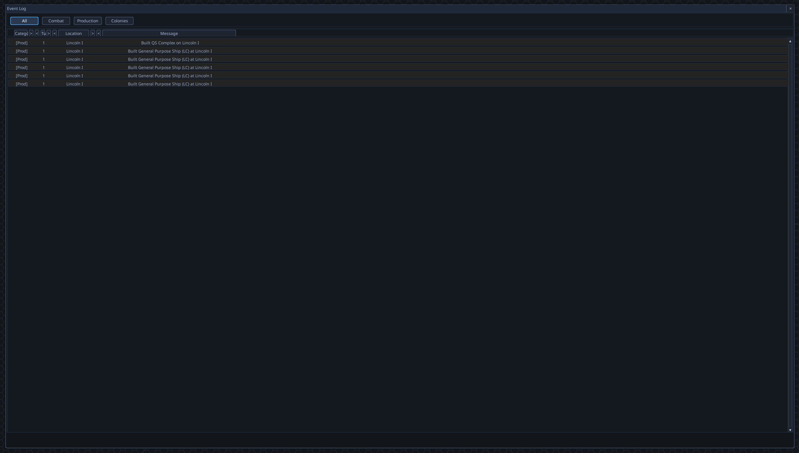

# Event log location column issues and broken navigation

## Description
The Event Log's "Location" column fails to display the sector information (showing only system). Additionally, double-clicking an event row does not navigate the camera to the event location.

## Screenshots
-  - *Shows the Event Log UI where the Location column is visible but lacking sector information.*
