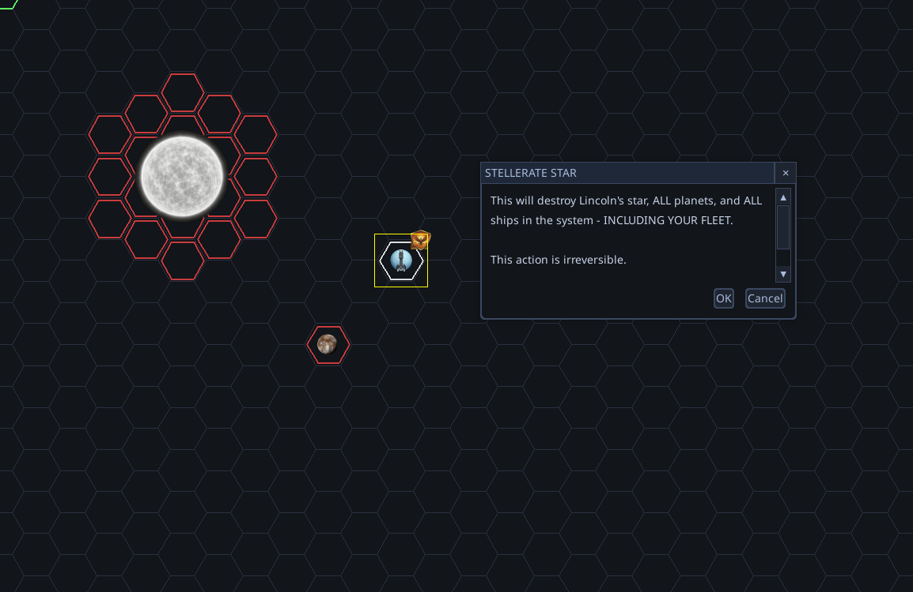

# Global order registration failure

## Description
Orders given to fleets (such as movement via 'M', colonizing, using cryopods, or destroying stars via 'Ctrl-Shift-S') fail to register in the order queue. UI prompts and warnings still appear, but confirming them results in no action.

## Screenshots
-  - *Shows the warning prompt appearing for the Star Destroyer order.*
-  - *Shows another view of the Star Destroyer order attempting to be issued but failing to register.*
