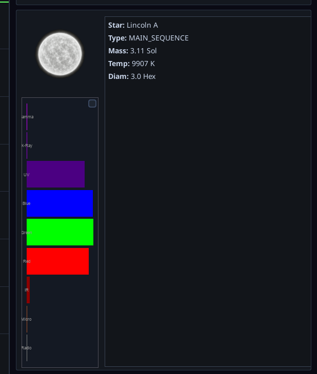
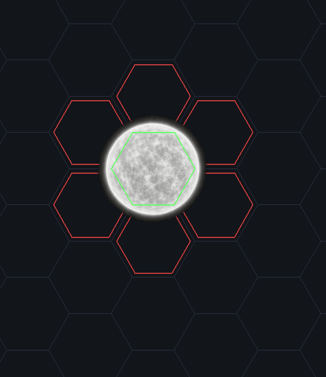
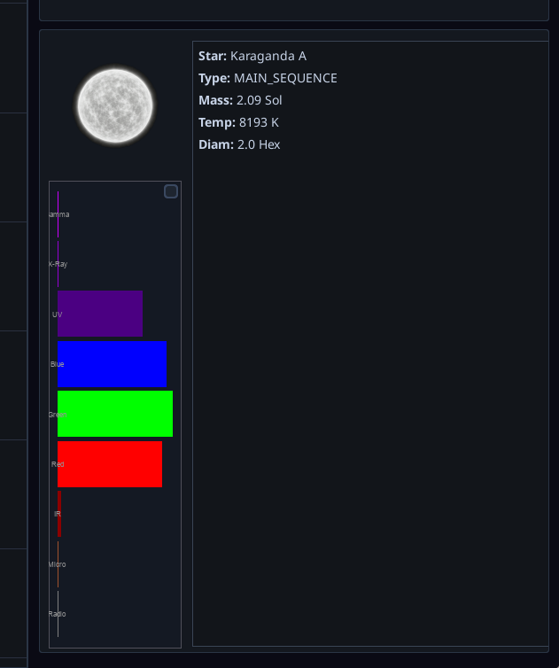

# Standardize star measurement to radius

## Description
Transition star size definitions and UI reporting from "diameter" to "radius" (where radius is the center hex plus outer rings) to resolve ongoing confusion over star map footprints. Stars with a specified "hex diameter" are currently incorrectly rendered using that value as their radius, making them significantly larger than intended (e.g., a 3-diameter star renders as 5 hexes in diameter).

## Screenshots
-  - *Shows a star that is supposed to be 3 hexes in diameter but occupies a larger area.*
-  - *Details of the oversized star for reference.*
-  - *Shows an example of a star that occupies the center plus an outer ring, illustrating a 2-radius footprint.*
-  - *Shows the UI reporting the same star as having a 2-diameter value instead of radius.*
