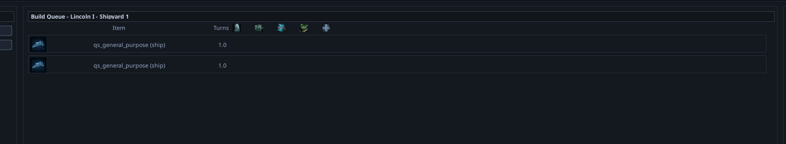
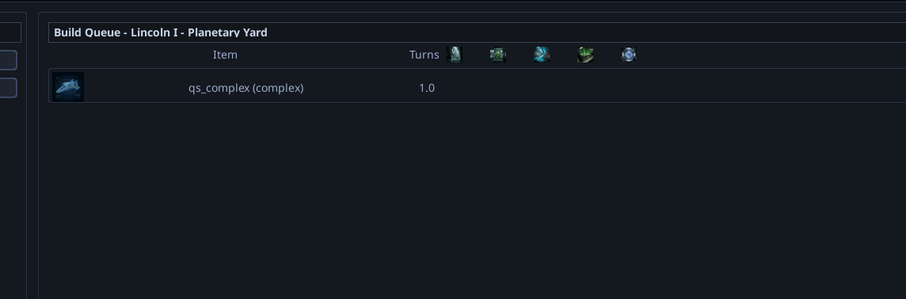
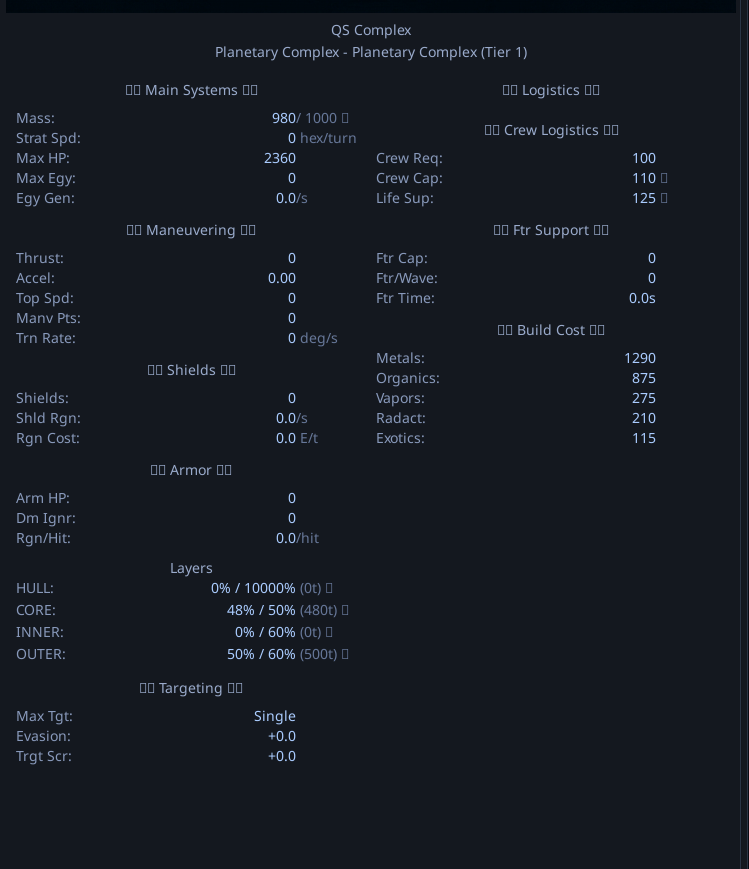

# Production queues default to 1 turn and 0 cost

## Description
The build queues for vehicles, designs, and complexes are incorrectly defaulting to a 1-turn build time and zero resource cost, ignoring the actual resource costs defined for these items.

## Screenshots
-  - *Shows 2 spacecraft queued up requiring only 1 turn and 0 resources.*
-  - *Shows a complex being built in the queue, similarly requiring 1 turn and 0 resources.*
-  - *Shows the actual expected resource values for the complex to compare against the bugged 0 cost.*
