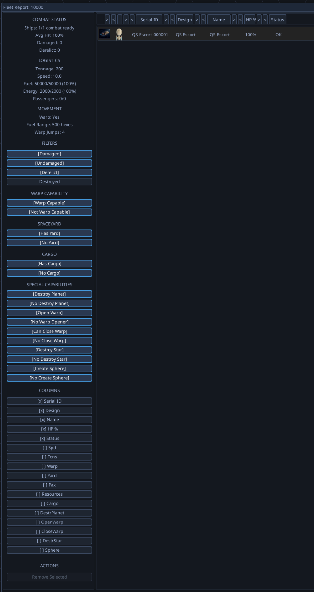

# Tri-State Filter Widget & UI Filter Unification

## Context

During QA session 20260314_094507, the current filter UI was observed to use paired toggle buttons (e.g., "Warp Capable" / "Not Warp Capable") where a single tri-state control would be more intuitive. Each binary attribute should have three mutually exclusive states: **Yes** (only matching), **No** (only non-matching), or **Ignore** (don't filter on this attribute). This pattern applies across Fleet Report, Planets List, and Empire Build Yards.

The same tri-state concept extends to queue status in the Build Yards (Active / Empty / Ignore) and should be applicable to any future binary-attribute filter.

## Screenshots

*Fleet Report filter sidebar showing the current paired Yes/No toggle button layout for Warp Capability, Spaceyard, Cargo, and Special Capabilities filters.*

## Code Investigation Findings

No reusable filter component exists — each of the 3 windows implements filters independently with different state management patterns:

**Fleet Report:**
- `game/ui/screens/fleet_report_sidebar.py` — filter button definitions (5 groups with paired Yes/No buttons)
- `game/ui/screens/fleet_report_filters.py` — modular filter functions (`_should_exclude_by_warp()`, etc.)
- `game/ui/screens/fleet_report_view_model.py` — individual boolean attributes per filter

**Planet List:**
- `game/ui/screens/planet_list_sidebar.py` — filter sections (type, owner, ranges)
- `game/ui/screens/planet_list_filters.py` — `filter_planets()` function
- `game/ui/screens/planet_list_window.py` — dict-based filter state

**Build Queue:**
- `game/ui/screens/empire_build_queue_sidebar.py` — filter button definitions
- `game/ui/screens/empire_build_queue_filter_manager.py` — `BuildQueueFilterManager` class
- `game/ui/screens/empire_build_queue_viewmodel.py` — manager-based filter state

Three different state management patterns are used across these windows (individual booleans, dicts, and a manager class).

## Scope Notes

This warrants a full project because it involves:

1. **New reusable widget** — Design and build a tri-state filter control (Yes / No / Ignore) that can be dropped into any sidebar
2. **Retrofit 3+ windows** — Fleet Report (5 filter groups), Planets List (future binary attributes), Empire Build Yards (queue status + future attributes)
3. **Unify filter state management** — The three windows use three different patterns; a common filter state model would reduce maintenance burden
4. **Consistent styling and behavior** — Ensure the tri-state widget looks and behaves identically across all instances
