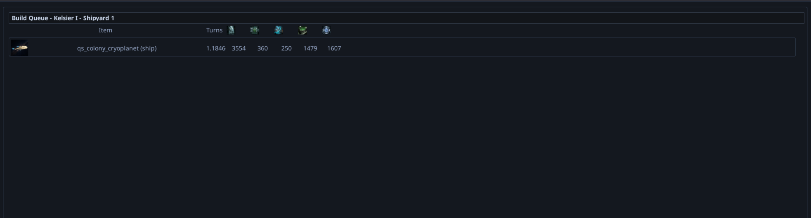

# Build Queue Configurable Columns & Column Reordering Fix

## Context
During QA session 20260314_212644, the user identified that the per-planet build queue needs a full rework to use the same configurable column system as the Planet List, Event Log, and Empire Build Yards windows. The current build queue uses hardcoded column positions in `BuildQueueRenderer` and shows only one set of resource values (remaining cost). The user wants two sets of resource columns — per-turn spend and total remaining — plus a build order column. Additionally, the column reordering arrows (left/right) in the shared column system don't work in any window.

This supersedes BUG-96, which dealt with incorrect resource display values in the build queue. The underlying display issues will be resolved by the proper column rework.

## Screenshots

*Current build queue for Kelsier I Shipyard showing qs_colony_cryoplanet with turns (1.1846) and total resource costs (3554, 360, 250, 1479, 1607). These columns should be split into per-turn spend and total remaining, and be configurable/reorderable.*

## Code Investigation Findings

### Build Queue Renderer (current state)
- **File:** `game/ui/screens/build_queue_renderer.py` — hardcoded column positions, does NOT use `TableColumnManager`
- **Formatter:** `game/ui/screens/empire_build_queue_formatter.py` has `get_resource_rate_text()` and `get_resource_total_text()` methods but the per-planet build queue doesn't use them

### Shared Column System
- **`TableColumnManager`** (`game/ui/components/table/column_manager.py`) — handles column definitions, visibility toggling, swap, and sort
- **`TableHeader`** (`game/ui/components/table/header.py`) — renders headers with left/right arrow buttons and sort buttons
- **`VirtualTable`** (`game/ui/components/table/virtual_table.py`) — scrolling table with header integration
- Used by Planet List, Event Log, and Empire Build Yards

### Column Reordering Bug
The left/right arrow buttons in `TableHeader` fire `swap_column` events, but the consuming windows never call `column_manager.swap_column()`:
- **`PlanetListWindow`** (line ~297) — detects `swap_column` result but never extracts column/direction or calls the manager
- **`EmpireBuildQueueWindow`** (line ~491) — detects `swap_col` but only processes `sort_col`, ignoring swap entirely
- **Event Log** — likely same pattern

### Per-Turn Spend Calculation
The user wants resource columns showing per-turn spend: the limiting resource gets the full production rate (e.g., 3000 metals/turn), and other resources are proportionally scaled based on `(resource_cost / limiting_resource_cost) * limiting_rate`. The utility `estimate_build_turns()` in `game/strategy/data/build_queue_source.py` already calculates the limiting resource.

## Scope Notes
This warrants a full project because:
1. **Build queue rework** — replace hardcoded columns with `TableColumnManager`/`VirtualTable` integration, matching the pattern used by Planet List and Empire Build Yards
2. **New column sets** — per-turn spend columns AND total remaining columns, both configurable
3. **Build order column** — a column showing queue position, with reordering done by sorting on this column and moving items
4. **Column reordering fix** — the `swap_column` handling is broken across all windows (Planet List, Empire Build Yards, Event Log) and needs a unified fix
5. **BUG-96 superseded** — the resource display issues tracked in BUG-96 will be resolved as part of the column rework
