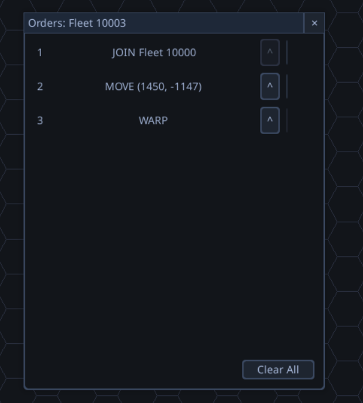

# Fleet Join Order Redirect Tracking

## Context
During QA session 20260324_122443, the user identified a missing capability: when Fleet A is ordered to join Fleet B, and Fleet B merges into Fleet C before Fleet A arrives, Fleet A's join order is silently cancelled with "Target invalid/destroyed." The desired behavior is that Fleet A's order automatically redirects to Fleet C. Similarly, if the target fleet is destroyed, pursuing fleets should have their orders cancelled with a log event rather than failing silently.

## Screenshots
The fleet orders dialog showing a JOIN_FLEET order targeting Fleet 10000:

## Code Investigation Findings

### Current Behavior
- `IssueJoinFleetCommand` creates two orders: `MOVE_TO_FLEET(target=B)` + `JOIN_FLEET(target=B)`, both holding direct object references to the target Fleet
- When Fleet B is removed (via merge or destruction), Fleet A still holds a reference to the now-defunct Fleet B object
- `FleetOrderProcessor.process_join_fleet()` checks `if target_fleet is None` — but the target is not None, it's an orphaned Fleet object with zero ships
- The order either silently fails or is cancelled with a warning log

### Key Files
- `game/strategy/data/fleet.py` — Fleet class with `merge_with()`, `clear_orders()`, `pop_order()`
- `game/strategy/data/empire.py` — `remove_fleet()` is the single choke point for all fleet removal
- `game/strategy/engine/fleet_order_processor.py` — Processes JOIN_FLEET orders each tick
- `game/strategy/engine/command_handlers.py` — `JoinCommandHandler` creates the two-order sequence
- `game/strategy/data/fleet_order_serializer.py` — Serializes/deserializes fleet order references
- `game/strategy/events/event_types.py` — Event type enum (no fleet events currently exist)

### Approaches Evaluated

**Three approaches were analyzed by independent agents:**

1. **Global Merge Chain Registry** — Persistent lookup table mapping old fleet IDs to surviving fleet IDs. Rejected: requires serialization, cleanup is hard (entries grow forever), destruction handling needs expensive reverse-lookups, and every `remove_fleet` call site must update the registry (shotgun surgery risk).

2. **Pursuers List (Recommended)** — Target fleet carries a `Set[Fleet]` of all fleets planning to join it. On merge, redirect all pursuers' orders to the new target and transfer the pursuers list. On destruction, cancel all pursuers' orders with log events. Zero serialization overhead (rebuilt from order references on load). Natural cleanup. Multi-hop chains work for free.

3. **Direct Order Rewriting at Merge Time** — Scan all fleet orders across all empires and rewrite targets at merge time. Simple but O(total orders) per merge, requires access to all empires, and doesn't help with destruction handling.

### Recommended Approach: Pursuers List

**Design sketch:**

- `Fleet` gains a `pursuers: Set[Fleet]` field (not serialized — rebuilt on load)
- `Fleet.add_pursuer(fleet)` / `Fleet.remove_pursuer(fleet)` for registration
- `Fleet.merge_with()` calls `_redirect_pursuers(new_target)` before transferring ships:
  - Rewrites all pursuers' MOVE_TO_FLEET/JOIN_FLEET order targets from self to new_target
  - Transfers pursuers set to new_target
  - Logs FLEET_JOIN_REDIRECTED event for each pursuer
- `Fleet.notify_pursuers_target_destroyed()` cancels all pursuers' join orders and logs FLEET_JOIN_CANCELLED
- `Empire.remove_fleet()` calls `notify_pursuers_target_destroyed()` as a safety net (empty after merge path, active after combat destruction)
- `Fleet.clear_orders()` and `Fleet.pop_order()` unregister from target fleets' pursuers lists
- `JoinCommandHandler.execute()` calls `target_fleet.add_pursuer(fleet)` after creating orders
- `FleetOrderSerializer.resolve_order_references()` rebuilds pursuers lists from order targets on load

**New event types under a new "Fleet Actions" category:**

| Event | When | Key Data |
|-------|------|----------|
| FLEET_JOINED | Fleet A successfully merges into Fleet B | fleet_id (A), target_fleet_id (B), location |
| FLEET_JOIN_REDIRECTED | Fleet A's target changes from B to C because B merged into C | fleet_id (A), old_target (B), new_target (C) |
| FLEET_JOIN_CANCELLED | Fleet A's join order cancelled because target B was destroyed | fleet_id (A), target_fleet_id (B) |

**Strengths:**
- Zero serialization overhead (pursuers rebuilt from existing order data on load)
- Natural cleanup through merge, destruction, and order cancellation paths
- O(1) destruction handling via direct access to affected fleets
- Multi-hop chains work without special-case code
- Consistent with existing codebase patterns (live object references, event logging)

**Risks:**
- Bidirectional coupling: every order mutation path must maintain the pursuers list. Mitigated by Fleet's consistent encapsulation of order operations via `add_order`/`pop_order`/`clear_orders`
- ~50-70 lines added to Fleet class (already flagged for god class decomposition in PROJ-86)

## Scope Notes

This warrants a full project rather than a bug fix because:
- **Data model changes** — New field on Fleet, new methods for pursuer lifecycle management
- **Event system expansion** — New event types and a new event category
- **Multiple integration points** — Fleet, Empire, FleetOrderProcessor, command handlers, serializer
- **Testing complexity** — Multi-hop chains, concurrent merges, destruction during pursuit, save/load round-trips, AI order reassignment edge cases
- **Design decisions required:**
  - Should intercept orders (`InterceptCommandHandler`) also register as pursuers?
  - Should pursuer logic be extracted to a `FleetPursuerTracker` delegate for consistency with god class decomposition projects (PROJ-86)?
  - What happens if a pursuer's owner is different from the target's owner (cross-empire join — likely not possible, but should be validated)?
