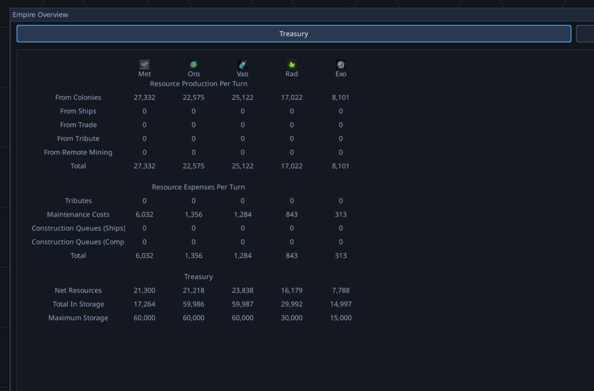

# Save/Load Verification Framework

## Context
During QA session 20260324_163416, loading a saved game and advancing a turn caused a crash because `ShipInstance` objects were missing registries after deserialization (BUG-107). The root cause was a single missing parameter in `GameSession.from_dict()`, but the deeper issue is systemic: there is no automated verification that the save/load round-trip preserves all object state. As new features and systems are added, there is no guard against serialization regressions.

*Empire Overview / Treasury screen shown just before the crash — user was checking resource numbers before advancing the turn after loading a save.*

## Screenshots

*The game appeared functional after load, but crashed on first turn advance due to missing registries on deserialized ships.*

## Code Investigation Findings

### Current Save/Load Architecture
- **Entry point:** `SaveGameService` in `game/strategy/systems/save_game_service.py` (468 lines)
- **Save format:** v2.0.0, strict version checking (rejects old saves), JSON-based
- **Folder structure:** `turns/` (per-turn state), `designs/empire_N/` (ship designs), `save_metadata.json`

### Serializable Types (26+)

| Layer | Types | Count |
|-------|-------|-------|
| Strategy Root | GameSession | 1 |
| Empire/Faction | Empire, RaceConfig | 2 |
| Fleet System | Fleet, FleetOrder, OrderType | 3 |
| Ship Instance | ShipInstance | 1 |
| Planets | Planet, PlanetaryFacility, SpeciesPopulation | 3 |
| Galaxy | Galaxy, StarSystem, Star, WarpPoint, Storm | 5 |
| Configuration | GameConfig, PlayerConfig | 2 |
| Design System | DesignMetadata, ShipSerializer | 2 |
| Events | EventLog, Event | 2 |
| Research | ResearchTracker, NodeState | 2 |
| Simulation Combat | Ship (combat), BattleState, ModifierEffect | 3 |
| **Total** | | **26** |

### Deserialization Complexity
- **Two-phase loading:** Galaxy created first (Phase 1), then Empires resolve planet references via galaxy (Phase 2)
- **Marker-based references:** Order targets stored as `_fleet_ref`/`_planet_ref` dicts, resolved in Phase 3
- **Pursuer tracking:** PROJ-222 requires post-load registration of fleet pursuers (Phase 4)
- **DI via registries:** Ships and Fleets accept optional `GameRegistries` for component lookup — the exact point that broke in BUG-107

### Existing Test Coverage
- **Location:** `tests/integration/save_load/` (6 test files)
- **Covers:** Folder structure, metadata, basic round-trip (config, empire IDs, fleet counts, colony counts, planet IDs), edge cases (corruption, version mismatch), resupply persistence, error handling
- **Gaps:** No field-level fidelity checks across all 26 types, no cross-layer reference integrity validation, no automated comparison of pre-save vs post-load state

## Scope Notes

This warrants a full project rather than a bug fix or feature because:

1. **Cross-cutting concern:** Touches all 26+ serializable types across every layer of the strategy engine
2. **Framework design required:** Need a reusable pattern so that when new serializable fields are added, verification is trivially extended — not a one-time test suite but an ongoing safety net
3. **Multi-phase deserialization:** Reference resolution, registry injection, and pursuer tracking create non-obvious dependencies that need systematic validation
4. **Scale:** Estimated 200-400 test cases for comprehensive coverage of round-trip fidelity, reference integrity, corruption handling, and scale testing
5. **Architectural implications:** May require changes to the serialization pattern itself (e.g., mandatory registry injection, automated field tracking, or a registration system for serializable types)

### Proposed Framework Components
- **Round-trip fidelity harness:** Save → load → deep-compare for each of the 26 types, with field-level diff reporting
- **Reference integrity checks:** Verify all cross-object pointers (fleet→ship, order→target, empire→colony) survive round-trip
- **Registry injection verification:** Ensure all objects requiring DI registries receive them during load
- **Regression guard:** A pattern or decorator that makes it easy to add new fields to verification when they're introduced
- **Live state comparison:** Optional harness that can snapshot a running game, save/load, and compare the result
