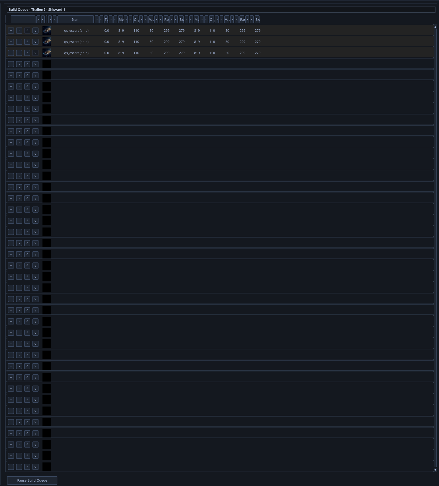
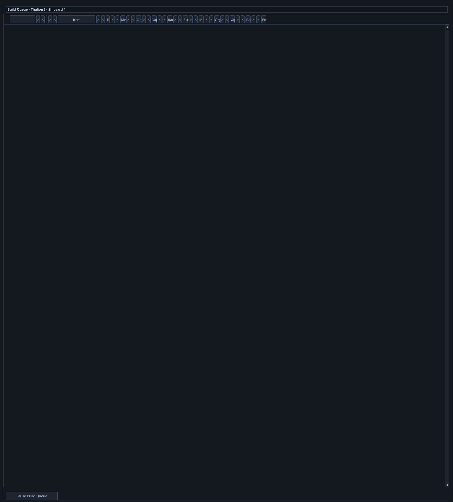
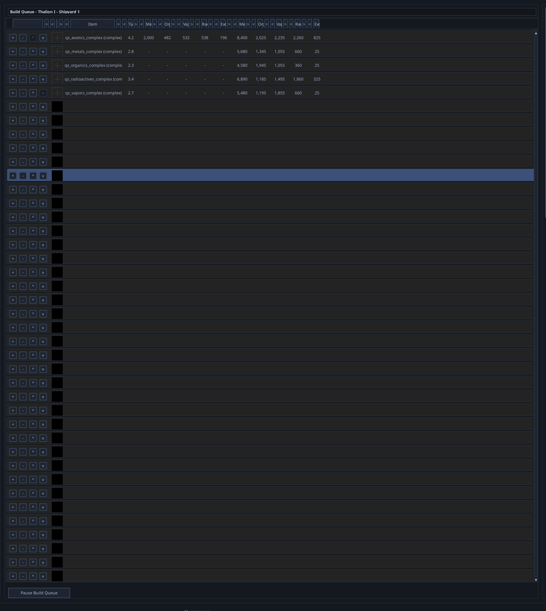
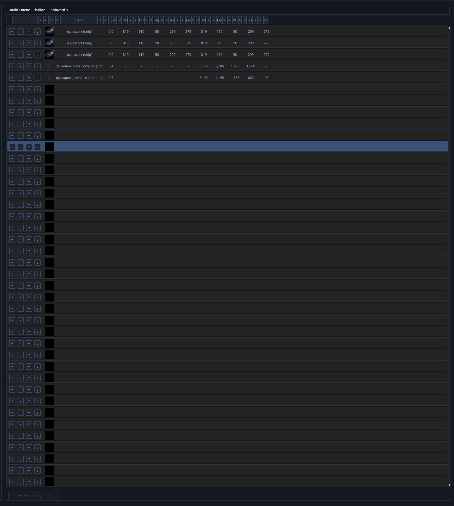
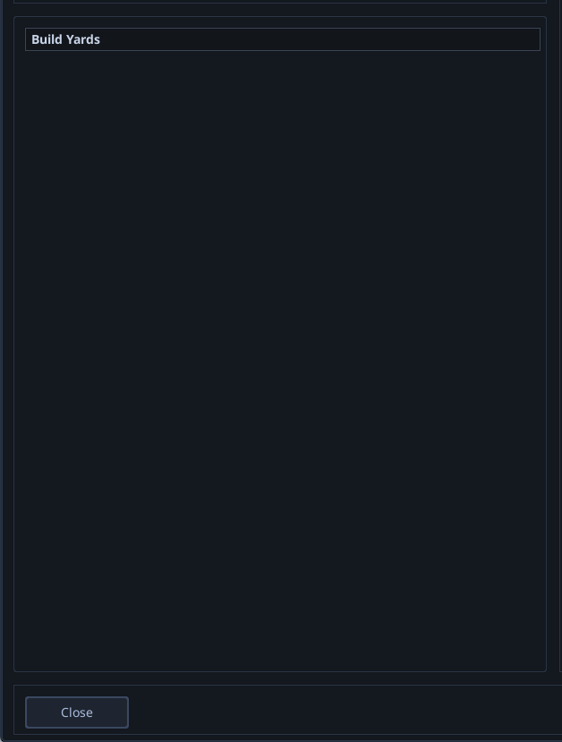

# Build Queue Caching Overhaul

## Context

Captured during QA session `20260510_060431` (2026-05-10 06:06–06:13). The user observed that the build queue UI, after recent performance work, now displays stale and contaminated state under several conditions. Cleaned commentary:

- The first time the build queue panel opens for a given yard it loads slower than the new perf target but renders correctly.
- The **second** time the panel is opened — same player, same planet, same yard — the legitimate queued items render at the top, but ~30+ ghost rows appear below: stray `+/-` and `↑/↓` buttons paired with blank portrait thumbnails and no item text or stats. One ghost row sometimes appears highlighted.
- Clicking a button on a ghost row removes the legitimate items from the displayed queue (the click is destructive).
- Cycling through the yards in the left-side selector eventually shows the correct contents for whichever yard is selected — i.e. the bug is masked by enough yard switches.
- Items added to a Shipyard appear in the Planetary Yard view (and vice versa) on the same planet until the user manually re-selects the correct yard.
- After ending the turn for the first player, opening the build queue on the second player's planet shows a merged display containing items from the previous player's yards (ships **and** complexes mixed) before this player has added anything. The user also reports that on this second player's planet, the yard selector does not let them pick between the planet's ship-yard and planetary-yard despite both existing — they cannot tell whether this is the same caching bug or a separate selector-init bug.
- After adding 5 harvest units to that second-player yard and reopening the panel, the same merged stale display reappears.

User's hypothesis: "we seem to be caching things that are only specific to a single build yard on a single location and we're displaying those things everywhere — in addition to the buttons and the blank portrait view image that's getting displayed every time that BS on every row."

## Screenshots

*Build Queue — Thalion I — Shipyard 1: 3 legitimate `qs_escort (ship)` entries at the top, then ~40 ghost rows of `+/- ↑↓` controls + blank portrait thumbnails with no text or stats.*

*After clicking a `+`/`-` on a ghost row, the legitimate ship entries disappear from the display.*

*After closing and reopening the build queue panel: only the newly added harvesting complexes (radioactives + vapors) appear at the top, but rows below are stale ghosts. A row in the middle is highlighted but has no content.*

*Second player's turn, on their own planet: the panel shows 3 escort ships plus radioactives + vapors complexes — a merged view of the previous player's two build yards. This player has not added anything yet.*

*Second player's planet with each yard individually selected: actually empty. The merged view above is purely cached UI state from the previous player.*

## Code Investigation Findings

The user's "we put in a bunch of effort to speed up the build queue" maps to two recent landed projects, both of which were correct in isolation:

- **PROJ-373 phase 3** (`aca743a25`) — `[VirtualTable._rebuild_row_pool()](../../../game/ui/components/table/virtual_table.py#L184)` early-returns when panel geometry (height, width, row height, visible columns) is unchanged. Saves ~1.5s per yard switch by reusing the row widget pool.
- **PROJ-376 phase 2** (`a93330bb9`) — `[BuildQueueScreen.open_for_yard()](../../../game/ui/screens/build_queue_screen.py#L264)` reuses a single screen instance across all yards instead of constructing a new one each open.

The data/UI sync gap appears when these compose:

1. `BuildQueueScreen.open_for_yard(new_yard)` updates `self.active_queue_source` and calls `_refresh_queue_display()` ([screen.py:342](../../../game/ui/screens/build_queue_screen.py#L342), [screen.py:544](../../../game/ui/screens/build_queue_screen.py#L544)).
2. `BuildQueueRenderer.refresh_queue_display()` calls `data_source.set_queue(queue, build_rate)` and then `virtual_table.update_visible_rows()`.
3. Because panel geometry is unchanged across yards, `_rebuild_row_pool()` early-returns, so the widget pool is **not** rebuilt. Existing row widgets retain `_last_text` / `_last_img` / `_last_color` from the previous yard.
4. `[VirtualTable.update_visible_rows()](../../../game/ui/components/table/virtual_table.py#L309)` maps new data indices through stale widgets. Rows beyond the new queue's length never call `row["bg"].hide()` because the dirty-tracking checks at [lines 319–323](../../../game/ui/components/table/virtual_table.py#L319) compare against stale row-count, not data identity.

This explains every symptom:

| Symptom | Cause |
|---|---|
| Ghost rows below legitimate items | Stale widgets past the new queue's length never hidden |
| Blank portraits + stray controls | Widget visuals partially cleared by reuse path but image+button widgets remain alive |
| Clicking ghost row destroys queue | `+/-` button handlers still bound to old data indices |
| Cycling yards "fixes" the display | Some yard switches change row-count enough to trip the dirty path and force a full re-render |
| Cross-yard contamination on the same planet | Same data source / widget pool shared across yards on a planet; `set_queue()` updates data but doesn't invalidate widget caches |
| Cross-player turn-boundary contamination | The reused `BuildQueueScreen` instance carries widget state across player turns; nothing flushes it on turn-end / ownership change |
| Missing yard-selector on second player's planet | Possibly the same shared-state bug (selector not re-initialized for the new player), possibly a separate selector lifecycle issue — needs investigation as part of the project |

[`game/ui/screens/build_queue_panel_factory.py:50`](../../../game/ui/screens/build_queue_panel_factory.py#L50) shows that `BuildQueueQueueDataSource` and `VirtualTable` instances are persisted across yard switches via the `BuildQueuePanels` dataclass — i.e. there is one shared rendering pipeline, not one per yard.

No build-queue errors or warnings appear in `tracking-assets/logs/issue-N/battle.log` for the affected window — the bug is silent from the engine's perspective.

## Scope Notes

This warrants a project rather than a bug fix because:

1. **Composes two independent perf optimizations.** A naive fix (e.g. always rebuild the row pool on yard switch) un-does PROJ-373's perf win. The project needs a targeted invalidation strategy that preserves the perf wins of PROJ-373 and PROJ-376 while flushing widget state correctly when the displayed *content* (not just geometry) changes.
2. **Spans multiple layers.** Touches `VirtualTable` (component layer), `BuildQueueRenderer` / `BuildQueueQueueDataSource` (panel layer), `BuildQueueScreen` lifecycle (screen layer), and turn-boundary handling (engine ↔ UI seam). Decisions in any one layer constrain the others.
3. **Includes an unresolved sub-question.** The "missing yard-selector on the second player's planet" symptom may share a root cause with the caching contamination, or may be a separate selector-init bug. The project should investigate and either fold it in or split it out with justification.
4. **Needs a regression-test surface.** Yard switching within a planet, close+reopen of the panel, end-of-turn → next-player open, and planets with both a ship-yard and a planetary-yard all need explicit coverage. Likely requires fixture support and possibly UI-state assertions that didn't exist before PROJ-373.
5. **Plausible design choices have trade-offs worth comparing.** Options include identity-based dirty tracking on rows, an explicit "content invalidation" hook between `set_queue()` and `update_visible_rows()`, an explicit "yard switch" hook on the screen lifecycle, or scoping the row-pool reuse to same-yard repaints only. These are architecture decisions, not a one-line fix.

## QA Source

- Session: `Tools/qa_observer/session_data/20260510_060431/`
- Timestamps: `06:06:43` – `06:12:43` (single continuous topic)
- Related projects: PROJ-373 (`aca743a25`), PROJ-376 (`a93330bb9`)
